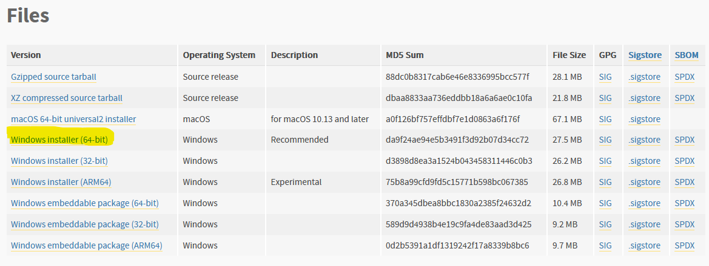
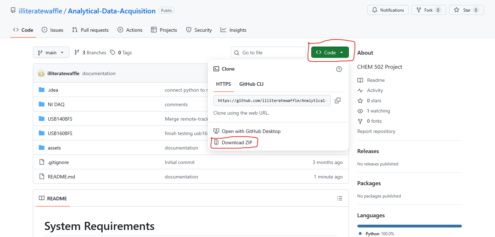

# System Requirements

Windows Version: Windows 10/11 64-bit

Hardware: MCC DAQ board connected and configured with InstaCal; NI DAQ board connected and configured with NI MAX.

# Setup

## 1. Python
(for Windows; https://wiki.python.org/moin/BeginnersGuide/Download)

1.1. Go to https://www.python.org/downloads/release/python-3135/ then scroll down to Files. Click on the yellow link if your system is 64 bit (Figure 1; most newer systems are 64 bit; check by pressing windows key and searching “system properties” and look for either “64-bit or x86”. If it's x86, then it is 32 bit and this program is not compatible).

1.2. Run the executable. Make sure to check the box “Add Python to PATH” during installation.

Figure 1. List of available Python installers. 32 bit version highlighted in yellow, 64 bit version highlighted in green.

## 2. InstaCal and NI MAX

2.1. Go to https://digilent.com/reference/software/instacal/start and download InstaCal

2.2. After installing InstaCal, connect your DAQ board to your computer and ensure it shows up in InstaCal.

2.3. Go to https://www.ni.com/en/support/downloads/drivers/download.ni-daq-mx.html#569353 and download NI MAX

2.4. Connect your NI DAQ board to the computer and ensure it shows up in NI Device Monitor.

## 3. Install Packages

3.1. Open the command prompt by pressing the Windows key. Then search up "cmd" and open command prompt.

3.2. Copy and paste this into the command prompt.
    
    pip install numpy matplotlib mcculw nidaqmx

3.3. Wait until you see it finishes (you'll see "successfully installed").

## 4. Program Files

4.1. Go to https://github.com/illiteratewaffle/Analytical-Data-Acquisition

4.2. Press the green "<> Code" button and press Download ZIP (Figure 2; the figure below may look different as the program updates, however please continue follow the instructions as is).

Figure 2. Location of buttons for installation.

4.3. Extract downloaded ZIP

## 5. Run the program

5.1. Open up the extracted zip file.

5.2. Open up the folder named after the DAQ board model

5.3. Double click "(model name).py" to run the program. Replace (model name) with the DAQ board model's name. If doesn't work, continue to step 5.4.

MCC USB-1408FS: run USB1408FS/USB1408FS.py

MCC USB-1608FS: run USB1608FS/USB1608FS.py

NI USB-6009: run NI DAQ/NI DAQ.py

The NI USB-6008 configuration should be the same as the USB-6009, however it has not been tested.

5.4. Right click "(model name).py" (Figure 3)

5.5. Click "Edit with IDLE" (Figure 3)

Figure 3. Location of "Edit with IDLE" for troubleshooting.

5.6. In the window that popped up, on the menu bar, select "Run" (Figure 4)

5.7. In the menu, select "Run module". Alternatively press F5 (Figure 4). Begin reading/troubleshooting error codes.

Figure 4.

# Program Configuration

## Measurement Computing's USB-1408FS, USB-1608FS Configuration

# 1. Configuration

1.1. Open Instacal and determine the number of the board you're using. For example, the USB-1408FS is board #1(Figure 5).

1.2. Enter the program and select "Configure tab"

1.3. In the fields "AI Board Number" and "DIO Board Number", enter the actual board number retrieved from Instacal earlier.

1.4. In the field "AI Channel", enter the channel where voltages are being read and recorded. Read the manufacturer's manual and check which analog channels are being used.

1.5. Press "Apply Configuration"

# 2. File Saving

2.1. You may select the save directory in the GUI by manually editing the text box or pressing "Browse".

2.2. In the selected directory, the program will create a new directory with the name "YYYY-MM", where YYYY is current year and MM is current month. This new directory is where the data file will be saved.

# 3. Auto run

3.1. Auto run will trigger at the xx:00:00 (hh:mm:ss) of every hour and at each multiple of the run duration.

## National Instrument's USB-6008, USB-6009 Configuration

# 1. Configuration

1.1. Open NI Device Monitor and determine the name of your device. For example, the USB-6009's name according to NI Device Monitor is "Dev2"

1.2. In the NI DAQ program, open "Configuration"

1.3. Under "Analog Channels", change the device name to the actual name of your device.

1.4. Press "Save Configuration"

1.5. Configure analog/digital input/output channels as needed.
