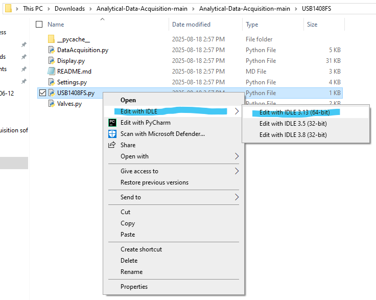
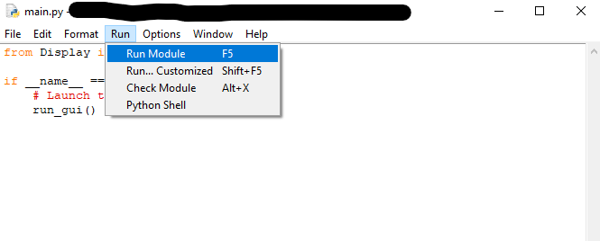

# System Requirements

Windows Version: Windows 7 or later

Hardware: MCC DAQ board connected and configured with InstaCal

# Setup

## 1. Python
(for Windows; https://wiki.python.org/moin/BeginnersGuide/Download)

1.1. Go to https://www.python.org/ftp/python/3.8.6/python-3.8.6.exe then scroll down to Files. Click on the yellow link if your system is 32 bit (Figure 1). Click on the green link if your system is 64 bit. If you don’t know, choose the yellow link (most newer systems are 64 bit; check by pressing windows key and searching “system properties” and look for either “64-bit or x86”. If it's x86, then it is 32 bit).

1.2. Run the executable. Make sure to check the box “Add Python to PATH” during installation.

Figure 1. List of available Python installers. 32 bit version highlighted in yellow, 64 bit version highlighted in green.

## 2. InstaCal

2.1. Go to https://digilent.com/reference/software/instacal/start and download InstaCal

2.2. After installing InstaCal, connect your DAQ board to your computer and ensure it shows up in InstaCal.

(Likely will show up as Board #0)

## 3. Install Packages

3.1. Open the command prompt by pressing the Windows key. Then search up "cmd" and open command prompt.

3.2. Copy and paste this into the command prompt.
    
    pip install numpy matplotlib mcculw

3.3. Wait until you see it finishes (you'll see "successfully installed").

## 4. Program Files

4.1. Go to https://github.com/illiteratewaffle/valvey

4.2. Press the green "<> Code" button and press Download ZIP (Figure 2).

Figure 2. Location of buttons for installation.

4.3. Extract downloaded ZIP

## 5. Run the program

5.1. Open up the extracted zip file.

5.2. Right click "main.py" (Figure 3)

5.3. Click "Edit with IDLE" (Figure 3)

Figure 3.

5.4. In the window that popped up, on the menu bar, select "Run" (Figure 4)

5.5. In the menu, select "Run module". Alternatively press F5 (Figure 4)

Figure 4.